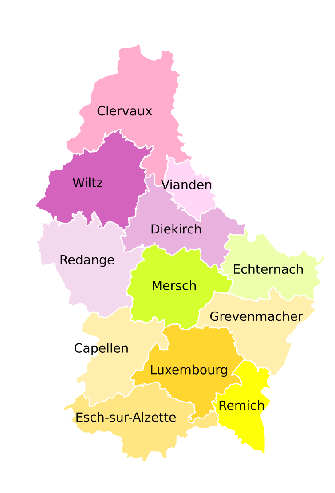

Petit pense-bête déstiné aux agents immobilier qui souhaitent réviser leur géographie du Luxembourg  
;-)

# Les cantons 

Le canton (en luxembourgeois : Kanton) est une division administrative du Luxembourg qui est la plus 
grande subdivision territoriale du Luxembourg, intermédiaire entre l'État et la commune.

La liste des cantons est la suivante :

* Capellen (chef lieu : Capellen)
* Clervaux (chef lieu : Clervaux)
* Diekirch (chef lieu : Diekirch)
* Echternach (chef lieu : Echternach)
* Esch-sur-Alzette (chef lieu : Esch-sur-Alzette)
* Grevenmacher (chef lieu : Grevenmacher)
* Luxembourg (chef lieu : Luxembourg)
* Mersch (chef lieu : Mersch)
* Redange (chef lieu : Redange)
* Remich (chef lieu : Remich)
* Vianden (chef lieu : Vianden)
* Wiltz (chef lieu : Wiltz)

# Les communes par cantons

## Listes des communes du canton de Capellen 

 * Dippach
 * Garnich
 * Habscht
 * Käerjeng
 * Kehlen
 * Koerich
 * Kopstal
 * Mamer
 * Steinfort

## Listes des communes du canton de Clervaux

 * Clervaux
 * Parc Hosingen
 * Troisvierges
 * Weiswampach
 * Wincrange

## Listes des communes du canton de Diekirch

 * Bettendorf
 * Bourscheid
 * Diekirch
 * Erpeldange
 * Ettelbruck
 * Feulen
 * Mertzig
 * Reisdorf
 * Schieren
 * Vallée de l'Ernz

## Listes des communes du canton de Echternach

 * Beaufort
 * Bech
 * Berdorf
 * Consdorf
 * Echternach
 * Rosport-Mompach
 * Waldbillig

## Listes des communes du canton de Esch-sur-Alzette

 * Bettembourg
 * Differdange
 * Dudelange
 * Esch-sur-Alzette
 * Frisange
 * Kayl
 * Leudelange
 * Mondercange
 * Pétange
 * Reckange-sur-Mess
 * Roeser
 * Rumelange
 * Sanem
 * Schifflange

## Listes des communes du canton de Grevenmacher

 * Betzdorf
 * Biwer
 * Flaxweiler
 * Grevenmacher
 * Junglinster
 * Manternach
 * Mertert
 * Wormeldange

## Listes des communes du canton de Luxembourg

 * Bertrange
 * Contern
 * Hesperange
 * Luxembourg
 * Niederanven
 * Sandweiler
 * Schuttrange
 * Steinsel
 * Strassen
 * Walferdange
 * Weiler-la-Tour

## Listes des communes du canton de Mersch

 * Bissen
 * Colmar-Berg
 * Fischbach
 * Heffingen
 * Helperknapp
 * Larochette
 * Lintgen
 * Lorentzweiler
 * Mersch
 * Nommern

## Listes des communes du canton de Redange

 * Beckerich
 * Ell
 * Grosbous
 * Préizerdaul
 * Rambrouch
 * Redange
 * Saeul
 * Useldange
 * Vichten
 * Wahl

## Listes des communes du canton de Remich

 * Bous
 * Dalheim
 * Lenningen
 * Mondorf-les-Bains
 * Remich
 * Schengen
 * Stadtbredimus
 * Waldbredimus

## Listes des communes du canton de Vianden

 * Putscheid
 * Tandel
 * Vianden

## Listes des communes du canton de Wiltz

 * Boulaide
 * Esch-sur-Sûre
 * Goesdorf
 * Kiischpelt
 * Lac de la Haute-Sûre
 * Wiltz
 * Winseler
 